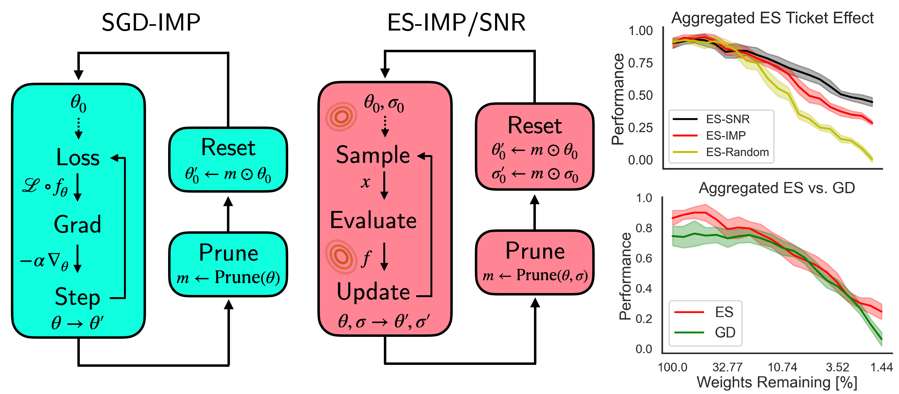

# Lottery Tickets in Evolutionary Optimization: On Sparse Backpropagation-Free Trainability
## Authors: R. Lange & H. Sprekeler (ICML, 2023)

This repository provides the source code for our ICML paper on sparse trainability of Evolution Strategies. At it's core we compare iterative magnitude pruning in Gradient Descent-based optimization with Gradient-Free Evolutionary Optimization methods. [[Paper Link](https://arxiv.org/abs/2306.00045)].

> Lange, R. T., Sprekeler, H. (2023), *Lottery Tickets in Evolutionary Optimization: On Sparse Backpropagation-Free Trainability.* International Conference on Machine Learning.



Below we outline how to execute a single configuration single random seed experiment for MNIST classification. This will require at least a single V100 GPU. All settings are executed in a similar fashion.

Please get in touch with [Robert Lange](https://roberttlange.github.io/) or open an issue if you have any detailed questions.


### Repository Structure

```
es-lottery
├── configs: Training and cluster experiment configurations.
├── notebooks: Notebooks for generating the core figures.
├── src: Source files for training different tasks with ES/GD.
├── tests: Test helpers for sparsification strategies.
├── run_es.py: Entry point for iterative pruning for ES.
├── run_gd_mnist.py: Entry point for iterative pruning for MNIST-GD.
├── run_gd_ppo.py: Entry point for iterative pruning run for Brax/Gym PPO.
├── run_transfer.py: Entry point for transfer experiments using previously trained ckpt.   
```

### Installation

Create a clean virtual environment (e.g. using an Anaconda distribution) and install all required dependencies.

```
conda create -n es_lottery python=3.9
source activate es_lottery
pip install -r requirements.txt
```

Separately install a JAX version capable of running on your accelerator (accomodating CUDA GPU/TPU driver requirements), e.g. via:

```
pip install --upgrade "jax[cuda12_pip]" -f https://storage.googleapis.com/jax-releases/jax_cuda_releases.html
```

In order to fully replicate all of the results you will have to train/evolve across different sparsity levels/IMP iterations and up to 5 random seeds. Running every single configuration sequentially will take a long time. We therefore outline how to train a single model first and then provide details on how to parallelize the training on a HPC using the [MLE-Infrastructure](https://github.com/mle-infrastructure).

## Experiments

### Executing a IMP Lottery Ticket Experiment

In order to create the results shown in figure 2 (lottery ticket effect with ES), please run the following script using 3 different settings for `imp_config/baseline_name` ∈ {`random-reinit`, `final-ticket`, `sig2noise`}:

```
# Run ES-Signal2Noise iterative pruning for CNN MNIST classification
python run_es.py -config configs/train/mnist.yaml
```

This will train CNNs at different sparsity levels with Sep-CMA-ES using on of the different pruning strategies and stores the checkpoints in `experiments/mnist` (ca. 3 hour runtime). Note that for the control experiments we use the old `brax` (v1) version with the legacy spring.

### Running the Gradient-Descent Baselines

We compare the sparse trainability of ES methods with gradient-based methods. To do so we implemented separate training functions for MNIST/Control PPO tasks. They can be executed as follows:

```
# Run GD-magnitude based IMP for CNN MNIST classification
python run_gd_mnist.py -config configs/train/sgd_mnist.yaml

# Run GD-magnitude based IMP for MLP Ant training
python run_gd_ppo.py -config configs/train/ppo_brax.yaml
```

### Executing a Ticket Transfer Experiment

```
# Run transfer ES training for sparse checkpoints generated by other ES SNR
python run_transfer.py -config configs/transfer/mnist_es2es.yaml

# Run transfer ES training for sparse checkpoints generated by GD IMP
python run_transfer.py -config configs/transfer/mnist_es2sgd.yaml
```

## Distributed Training on a HPC

The grid sweep experiments over different parameters (tasks, baselines, seeds) are organized using the [MLE-Infrastructure](https://github.com/mle-infrastructure). It provides a framework for logging and scheduling experiments on either Slurm, OpenGridEngine or Google Cloud Platform. It can be installed via

```
pip install mle-toolbox[full]
```

After installing the requirements and if you have access to one of these resources, you can initialize/setup the toolbox using the CLI command `mle init`. After successful installation of the `mle-toolbox` package and the following cluster/GCP credential verification you should be able to replicate the main grid searches from the command line as follows:

```
# Run 5 seed experiment for ES pruning for 3 pruning strategies
mle run configs/cluster/cluster_hpc_es_mnist.yaml
```

The results will be stored in `experiments/mnist_blines`.


## Figure Creation Notebooks

Due to the file size we do not provide all raw numerical results and sparse checkpoints. Please feel free to reach out if you would like to get access to such files. In the `notebooks/` subdirectory we provide Jupyter notebooks for replicating the figures:

- `notebooks/f2_blines.ipynb`: Pruning baseline results shown in Figure 2.
- `notebooks/f3_gd_es.ipynb`: GD-IMP versus S2N-ES results shown in Figure 3.
- `notebooks/f4_5_transfer.ipynb`: ES sparse checkpoint transfer results shown in Figure 4/5.
- `notebooks/f6_viz_connect.ipynb`: Mode connectivity ES vs GD shown in Figure 6.
- `notebooks/f7_s2n.ipynb`: Pruning threshold analysis shown in Figure 7.